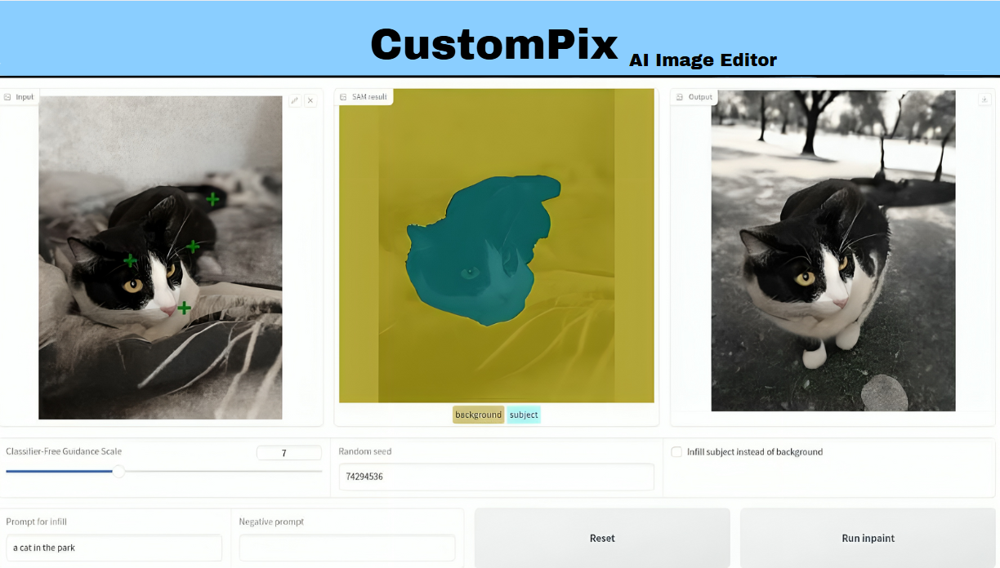

# CustomPix: Advanced AI-Powered Image Editor

CustomPix is an advanced AI-powered image editing platform that provides seamless tools for inpainting, object removal, background replacement, and subject substitution. With an intuitive user interface powered by Gradio, CustomPix allows users to manipulate images effortlessly using state-of-the-art machine learning models such as SAM (Segment Anything Model) and Stable Diffusion.

---

## Features

CustomPix enables users to perform a variety of image editing tasks, including:

- **Background Substitution**
- **Subject Substitution**
- **Object Removal**
- **Advanced Inpainting**

The workflow involves uploading an image, selecting objects interactively, refining masks as needed, and providing text prompts to guide AI-based edits. Users can swap out the background or substitute the subject while retaining the original background.



---

## How It Works

### 1. Object Selection
- The Segment Anything Model (SAM) generates masks for objects in the uploaded image.
- Users can refine masks manually using the interactive editor.

### 2. AI-Powered Inpainting
- Stable Diffusion Inpainting replaces masked areas based on user-provided text prompts.

### 3. Real-Time Editing
- All operations are performed in real-time with progress indicators for transparency.

### 4. History Viewer
- The gallery component allows users to view past edits and compare results.

---

## Installation & Execution

### 1. Clone the Repository
```bash
git clone https://github.com/yourusername/CustomPix.git
cd CustomPix
```

### 2. Create a Virtual Environment
```bash
python -m venv CUSTOMPIX_ENV
```

Activate the environment:

- **On Windows:**
  ```bash
  CUSTOMPIX_ENV\Scripts\activate
  ```
- **On macOS/Linux:**
  ```bash
  source CUSTOMPIX_ENV/bin/activate
  ```

### 3. Install Dependencies
```bash
pip install -r requirements.txt
```

### 4. Run the Application
```bash
python src/main.py
```
This will launch the Gradio interface locally at `http://127.0.0.1:7860`. Open this URL in your browser to access CustomPix.

---

## Examples

### Example 1: Background Replacement

 

In this example, the user replaced a plain background with a serene beach scene by providing a text prompt: *"A serene beach with clear blue skies."*

### Example 2: Object Removal

 

Here, an unwanted object (a chair) was seamlessly removed from the image using CustomPix's inpainting feature.

---

## Project Structure

```
CustomPix/
├── src/
│   ├── models/
│   │   ├── sam_model.py          # Segment Anything Model integration
│   │   └── inpainting_model.py   # Stable Diffusion Inpainting integration
│   ├── utils/
│   │   ├── image_processing.py   # Image loading, saving, preprocessing utilities
│   │   └── mask_generation.py    # Mask refinement utilities
│   ├── ui/
│   │   ├── components.py         # Gradio UI components like mask editor and gallery
│   │   └── layout.py             # Layout structure for Gradio interface
│   └── main.py                   # Main application logic integrating all components
├── assets/
│   └── style.css                 # Custom styling for Gradio interface
├── data/
│   ├── input/                    # Folder for input images
│   └── output/                   # Folder for processed images
├── configs/
│   └── model_config.yaml         # Configuration file for model paths and parameters
├── requirements.txt              # Dependencies list for Python packages
└── README.md                     # Project documentation file
```

---

## Contributing

We welcome contributions! If you'd like to contribute to CustomPix, please follow these steps:

1. **Fork** the repository.
2. **Create a new branch** (`git checkout -b feature-name`).
3. **Make your changes** and commit them (`git commit -m "Add feature"`).
4. **Push to your branch** (`git push origin feature-name`).
5. **Submit a pull request**.

---

## License

This project is licensed under the **MIT License**.

---

## Contact

For any questions, issues, or feature requests, feel free to open an issue on GitHub or reach out via email at `your_email@example.com`.

Happy Editing with CustomPix! 🎨✨
